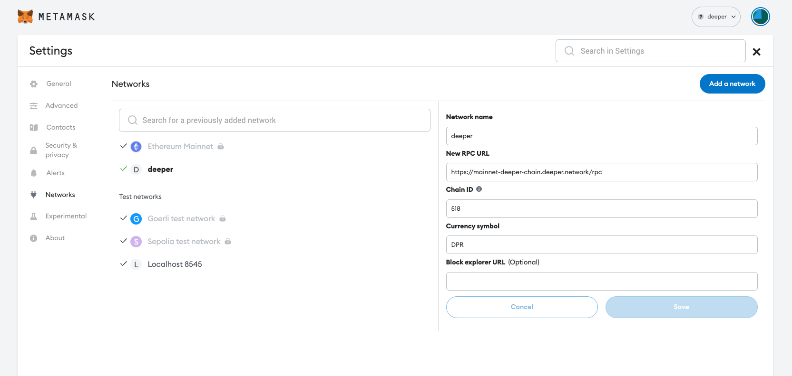
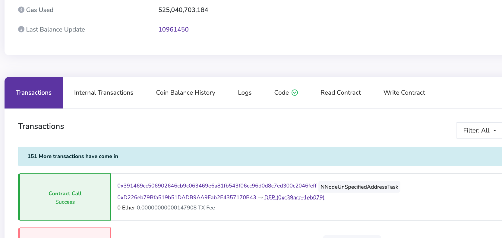

# Prerequisites
In this chapter we will be talking about some of the techinques and frameworks that DEP uses, it is vital to the developement of DEP APP.

## Docker
In order to build an DEP APP, one must have the knowledge to write the corresponding `Dockerfile` and build the image with `docker build`.

You will also need to know about `docker push` command to push the image to the cloud, so that every DEP device can access this image.

First you can go to the [docker 101](https://www.docker.com/101-tutorial/) page to download and install docker, you can choose to install by using `docker desktop` or system package manager.

Then make sure docker daemon is running by checking `docker run -it --rm hello-world` which should print the following information:
```bash
Hello from Docker!
This message shows that your installation appears to be working correctly.

To generate this message, Docker took the following steps:
 1. The Docker client contacted the Docker daemon.
 2. The Docker daemon pulled the "hello-world" image from the Docker Hub.
    (amd64)
 3. The Docker daemon created a new container from that image which runs the
    executable that produces the output you are currently reading.
 4. The Docker daemon streamed that output to the Docker client, which sent it
    to your terminal.

To try something more ambitious, you can run an Ubuntu container with:
 $ docker run -it ubuntu bash

Share images, automate workflows, and more with a free Docker ID:
 https://hub.docker.com/

For more examples and ideas, visit:
 https://docs.docker.com/get-started/
```

## Etherum contract calls
A "smart contract" is simply a program that runs on the Ethereum blockchain. It's a collection of code (its functions) and data (its state) that resides at a specific address on the Ethereum blockchain.

Smart contracts are a type of Ethereum account. This means they have a balance and can be the target of transactions. However they're not controlled by a user, instead they are deployed to the network and run as programmed. User accounts can then interact with a smart contract by submitting transactions that execute a function defined on the smart contract. Smart contracts can define rules, like a regular contract, and automatically enforce them via the code. Smart contracts cannot be deleted by default, and interactions with them are irreversible.

To start calling DEP contract, you will need a wallet manager such as metamask, then you will need to config your network as follow:



Then you can access the [DEP contract page](https://evm.deeper.network/address/0xC39acC1B3FA595BBaF916A5D6aD222afc91EB079) to view all the transactions and available contract calls:



You can check available calls on the `Read Contract` and `Write Contract` tab.

## SOL

## Rust