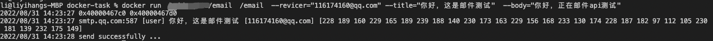

# How to build DEP APP

# 1. Decentralized email
（1 clone the code

git clone [https://github.com/difttt/docker-task](https://github.com/difttt/docker-task/tree/send_mail_with_cmd)

git checkout [send_mail_with_cmd](https://github.com/difttt/docker-task/tree/send_mail_with_cmd) 

（2 modify the code
modify auth key in `server/main.go` 
auKey := "youraukey”, change `youraukey` to your qq email auth key.

em.From = "[402513681@qq.com](mailto:402513681@qq.com)", change "[402513681@qq.com](mailto:402513681@qq.com)" to your qq email

To get ppoe auth key refer to this [documentation](https://service.mail.qq.com/cgi-bin/help?subtype=1&id=28&no=1001256) 

# 2 Build the docker image

（Notice that Deeper device are almost all based on ARM，if you are using x86 computer, you need to specify `--platform` to `linux/arm64/v8` which allows you to cross compile）

docker build --tag yourdockerhubaccount/email --platform=linux/arm64/v8 .

docker run yourdockerhubaccount/email /email -[-revicer="116174362@qq.com](mailto:--revicer=%22116174160@qq.com)" --title="test_title" --body="test_body"



# 3 Publish the image

(Notice that the repo must be public for anyone to pull)

docker push yourdockerhubaccount/email

# 4 Publish task

(Notice that you will need to contact the dev team to acquire EZC token and add your EVM address to the contract whitlist)

Network Name：Deeper

New RPC URL： [https://mainnet.deeper.network/rpc]()

Chain ID：518

Currency Symbol：DPR

[https://evm.deeper.network/address/0xC39acC1B3FA595BBaF916A5D6aD222afc91EB079/write-contract#address-tabs](https://evm.deeper.network/address/0xC39acC1B3FA595BBaF916A5D6aD222afc91EB079/write-contract#address-tabs)

（1 connect metamask

connect wallet


（2 使用nNodeUnSpecifiedAddressTask publish task, click write

Description：

url： docker images url

options：docker image params

maxRunNum：maxmium running task number

maintainBlocks：maximum maintain running blocks, 1 block for 6 seconds

Then hit write button

Example：

url：yourdockerhubaccount/email:latest

options：/email -[-revicer="116174362@qq.com](mailto:--revicer=%22116174160@qq.com)" --title="test_title" --body="test_body"

maxRunNum：1

maintainBlocks：100


# 5 Confirm results

（1 Wait for trasaction


（2 Check for transaction logs

[https://blockscount-dev.deeper.network/tx/0x9590770e78ea56091aef8d9c4d75b231f9af95867a9000ddf6524dc5bde35803](https://blockscount-dev.deeper.network/tx/0x9590770e78ea56091aef8d9c4d75b231f9af95867a9000ddf6524dc5bde35803)

url, options, maxRunNum and maintainBlocks varies by your inputs


Tips: 

If you are using your own Deeper device, you can assign the task to your device by using `nNodespecifiedAddressTask` and specify the `receivers` to your Deeper device's eth address.

---

# Oracle price
Oracle price is a program that gets the price of a given coin from some trading market, then feed it to the chain.

One way of doing this is to use a price council which select a bunch of servers as council members, they are the only ones that can upload the price.

However loot council is not excatly decentralized and vulnerable to hackers.

Dep on the other hand, one cannot even predict the device that is running the oracle price program, so it's very difficult for hackers to intercept the process.

## APP developement

First we need to get the price from the market, something like an http request:
```rust
async fn get_gateio_price() -> Result<u64, Box<dyn std::error::Error>> {
    log::info!("Using gateio price");
    let now = timestamp() / 1000;
    let resp =
        reqwest::get(format!("https://www.gate.io/json_svr/query/?u=10&c=9349111&type=tvkline&symbol=dpr_usdt&from={}&to={}&interval=1800", now-24*60*60*1000, now))
            .await?
            .text()
            .await?;
    let prices = resp.split("\n").collect::<Vec<&str>>();
    let price = prices[prices.len() - 2].split(",").collect::<Vec<&str>>();
    Ok((price[4].parse::<f32>()? * 10e17).round() as u64)
}
```

Then you post it to your endpoint:
```rust
let sub = sub_client::Substrate::new(endpoint).await.unwrap();
if let Err(e) = sub
    .set_dpr_price(
        price as u128,
        sub_client::polkadot::runtime_types::primitive_types::H160(buffer),
        operator_substrate_phrase,
    )
    .await
{
    log::error!("Failed to submit dpr price: {:?}", e);
    return Ok(());
}
```
You can also use an http endpoint to receive the prices, then apply some price filters to the prices.

Once the APP is done, just build the docker image and follow the steps above to send your new oracle price tasks.

# Refer

 [oracle in rust](https://github.com/difttt/oracle_price/tree/main) 

[go mail](https://github.com/difttt/docker-task/tree/send_mail_with_cmd) 

[benchmark using shell and lua](https://github.com/difttt/task-benchmark.git)

[DEP introduce](https://github.com/deeper-chain/web3d/blob/master/src/lib.rs) 

[Web3d container standars](https://github.com/deeper-chain/web3d/wiki/Web3D-container-standards) 