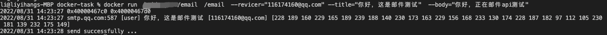

# How to build DEP APP

# 1. APP developement

(We will use decentralized email as an example)

（1 clone the code

git clone [https://github.com/difttt/docker-task](https://github.com/difttt/docker-task/tree/send_mail_with_cmd)

git checkout [send_mail_with_cmd](https://github.com/difttt/docker-task/tree/send_mail_with_cmd) 

（2 modify the code
modify auth key in `server/main.go` 
auKey := "youraukey”, change `youraukey` to your qq email auth key.

em.From = "[402513681@qq.com](mailto:402513681@qq.com)", change "[402513681@qq.com](mailto:402513681@qq.com)" to your qq email

To get ppoe auth key refer to this [documentation](https://service.mail.qq.com/cgi-bin/help?subtype=1&id=28&no=1001256) 

# 2 Build the docker image

（Notice that Deeper device are almost all based on ARM，if you are using x86 computer, you need to specify `--platform` to `linux/arm64/v8` which allows you to cross compile）

docker build --tag yourdockerhubaccount/email --platform=linux/arm64/v8 .

docker run yourdockerhubaccount/email /email -[-revicer="116174362@qq.com](mailto:--revicer=%22116174160@qq.com)" --title="test_title" --body="test_body"

# 3 Publish the image

(Notice that the repo must be public for anyone to pull)

docker push yourdockerhubaccount/email

# 4 Publish task

(Notice that you will need to contact the dev team to acquire EZC token and add your EVM address to the contract whitlist)

Network Name：Deeper

New RPC URL： [https://mainnet.deeper.network/rpc]()

Chain ID：518

Currency Symbol：DPR

[https://evm.deeper.network/address/0xC39acC1B3FA595BBaF916A5D6aD222afc91EB079/write-contract#address-tabs](https://evm.deeper.network/address/0xC39acC1B3FA595BBaF916A5D6aD222afc91EB079/write-contract#address-tabs)

（1 connect metamask

connect wallet

（2 使用nNodeUnSpecifiedAddressTask publish task, click write

Description：

url： docker images url

options：docker image params

maxRunNum：maxmium running task number

maintainBlocks：maximum maintain running blocks, 1 block for 6 seconds

Then hit write button

Example：

url：yourdockerhubaccount/email:latest

options：/email -[-revicer="116174362@qq.com](mailto:--revicer=%22116174160@qq.com)" --title="test_title" --body="test_body"

maxRunNum：1

maintainBlocks：100

# 5 Confirm results

（1 Wait for trasaction

（2 Check for transaction logs

[https://blockscount-dev.deeper.network/tx/0x9590770e78ea56091aef8d9c4d75b231f9af95867a9000ddf6524dc5bde35803](https://blockscount-dev.deeper.network/tx/0x9590770e78ea56091aef8d9c4d75b231f9af95867a9000ddf6524dc5bde35803)

url, options, maxRunNum and maintainBlocks varies by your inputs

Tips: 

If you are using your own Deeper device, you can assign the task to your device by using `nNodespecifiedAddressTask` and specify the `receivers` to your Deeper device's eth address.

# Refer

 [oracle in rust](https://github.com/difttt/oracle_price/tree/main) 

[go mail](https://github.com/difttt/docker-task/tree/send_mail_with_cmd) 

[benchmark using shell and lua](https://github.com/difttt/task-benchmark.git)

[DEP introduce](https://github.com/deeper-chain/web3d/blob/master/src/lib.rs) 

[Web3d container standars](https://github.com/deeper-chain/web3d/wiki/Web3D-container-standards) 